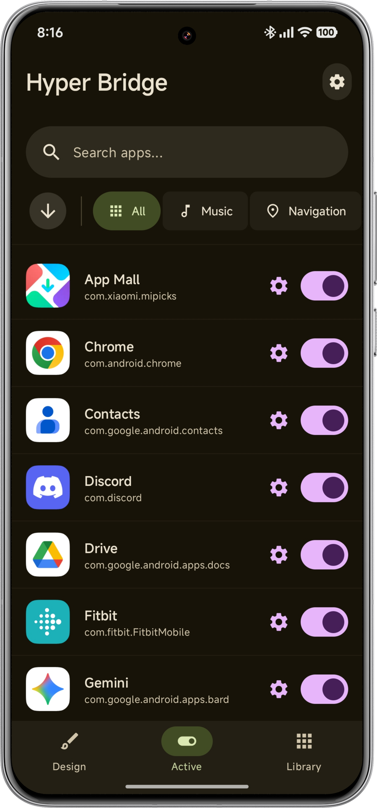
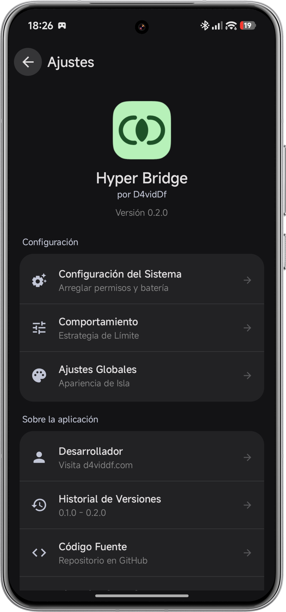
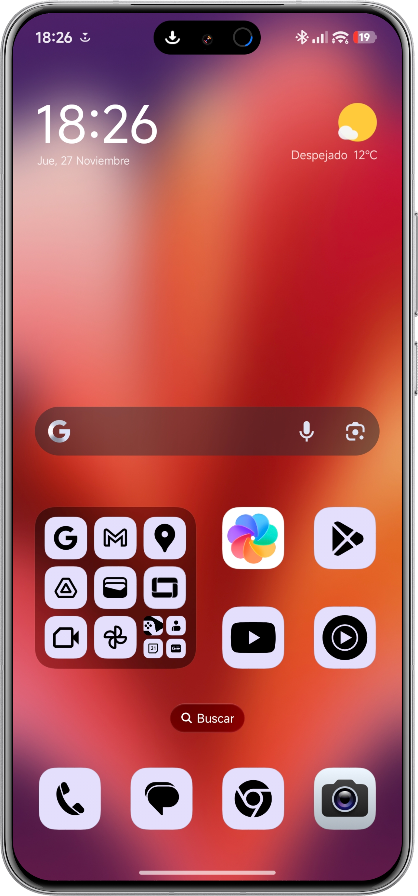

  

<h1 align="center">Hyper Bridge</h1>

  <strong>Bring the native HyperIsland experience to third-party apps on HyperOS.</strong>

  Hyper Bridge bridges standard Android notifications into the pill-shaped UI around the camera cutout, offering a seamless, iOS-like experience on Xiaomi phones.

  

  
  
  

 

## 🚀 Features

* **Native Visuals:** Transforms notifications into HyperOS system-style islands.
* **Smart Integration:**
    * **🎵 Media:** Show album art and "Now Playing" status.
    * **🧭 Navigation:** Real-time turn-by-turn instructions (Google Maps, Waze) with split layout (Distance Left, Turn Right).
    * **⬇️ Downloads:** Circular progress ring with a satisfying "Green Tick" animation upon completion.
    * **📞 Calls:** Dedicated layout for incoming and active calls with timers.
* **Per-App Configuration:** Choose exactly which apps trigger the island, customize timeouts, and toggle floating behavior.
* **Priority System:** Drag-and-drop reordering to decide which app takes precedence when multiple activities are active.

## 🌐 Supported Languages

HyperBridge is fully localized for:

* 🇺🇸 **English** (Default)
* 🇪🇸 **Spanish** (Español)

## 🛠️ Tech Stack

* **Language:** Kotlin
* **UI:** Jetpack Compose (Material 3 Expressive)
* **Architecture:** MVVM
* **Storage:** DataStore Preferences
* **Services:** NotificationListenerService, BroadcastReceiver
* **Concurrency:** Kotlin Coroutines & Flow

## 📸 Screenshots

| Home Screen | Settings | Active Island |
|:---:|:---:|:---:|
|  |  |  |

## 📥 Installation

### Option 1: Google Play Store (Recommended)
The easiest way to install and keep the app updated.

### Option 2: Manual APK
1.  Download the latest APK from the [Releases](https://github.com/D4vidDf/HyperBridge/releases) page.
2.  Install the APK on your Xiaomi/POCO/Redmi device.

### ⚙️ Setup (Required for both methods)
1.  Grant **"Notification Access"** when prompted.
2.  **Critical:** Follow the in-app guide to enable **Autostart** and **No Restrictions** (Battery) to prevent the system from killing the background service.

## 🤝 Contributing

Contributions are welcome! Please read our [Contributing Guidelines](CONTRIBUTING.md) before submitting a Pull Request.

1.  **Fork** the repository.
2.  Create a new branch (`git checkout -b feature/AmazingFeature`).
3.  Commit your changes (`git commit -m 'Add some AmazingFeature'`).
4.  Push to the branch (`git push origin feature/AmazingFeature`).
5.  Open a **Pull Request**.

## 📜 License

Distributed under the Apache 2.0 License. See `LICENSE` for more information.

## 👤 Developer

**D4vidDf**
* Website: [d4viddf.com](https://d4viddf.com)
* GitHub: [@D4vidDf](https://github.com/D4vidDf)
